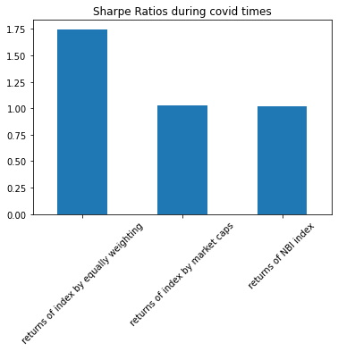

# PROJET 1 : A COVID-19 THEME ETF

## Introduction

This project aims to create an ETF for covid vaccination companies, based on a “vaccination company index” that we will create. The goal is to use this index to compare the performance of vaccination companies to the performance of the biotechnology industry and the general market. Because we consider the Covid-19 pandemic a markt changing event, we will look back at the pre-covid years and the performance during covid. 

## Question 1: Which companies compose the etf?

Initially, we follow a list of COVID vaccines developers. We looked at the backgrond of each of the companies and selected 10 companies. The companies that are filtered out are companies that are either not publicly traded at least 1 year before the pandemic started (so we can have enough data), state companies, and private companies. Finally the following 10 companies are selected:

1. Moderna (MRNA)			$1.73 B
2. Inovio (INO)				$1.69B
3. Pfizer (PFE)				$246.36B
4. AstraZeneca (AZN)			$187.99B
5. Novavax (NVAX)			$18.48B
6. Medicago (MDGS)			$1.41B
7. Johnson & Johnson (JNJ)		$432.67B
8. Merck (MRK)				$186.33B
9. Sanofi (SNY)				$120.86B
10. GlaxoSmithKline plc (GSK)	$96.58B	

## Question 2: What should be the weight of each company in the ETF?

We have considered two options.

1. Equally weighted - each company is 10% of the ETF
2. Weighted by market cap

Since some of the largest company may dominate the ETF, we set a maximum weight of any company to 15%. 

## Question 3: How will our ETF perform comparing to a benchmark index?

We use the Nasdaq Biotechnolgoy Index as our benchmark index. As shown, an ETF by equal weight is performing better in returns.

It is especially obvious during the COVID19 pandemic.

